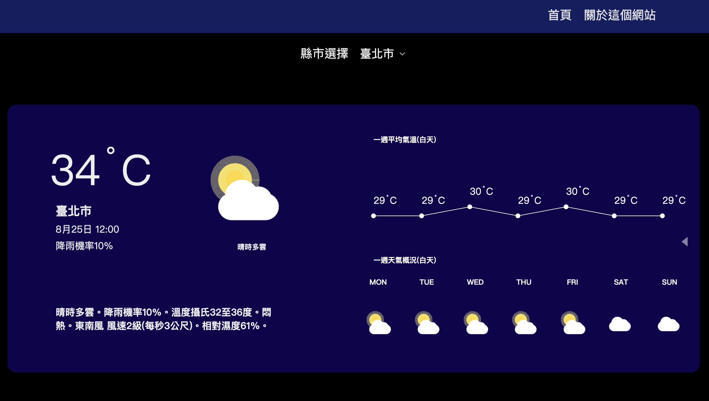

一個使用 React 開發，並透過 中央氣象局開放資料 API (CWB Open Data API) 取得天氣資訊的應用程式。

🚀 功能特色

查詢特定城市/地區的天氣資訊

顯示當前氣溫、天氣狀況、降雨機率等資料

介面簡單，資料即時更新

🛠️ 使用技術

React 18

JavaScript (ES6+)

Fetch API 串接中央氣象局 API

Tailwind CSS（如果你有用到的話）

📦 安裝與使用

Clone 專案

git clone https://github.com/你的帳號/weather-app.git
cd weather-app

安裝套件

npm install

建立 .env 檔案，加入你的氣象局 API 金鑰：

REACT_APP_CWB_API_KEY=你的 API 金鑰

啟動開發伺服器

npm start

在瀏覽器開啟 http://localhost:3000

🔑 取得 API 金鑰

前往 中央氣象局開放資料平台
申請會員並取得 API Key。

📂 專案結構
weather-app/
├── public/
│ └── index.html
├── src/
│ ├── components/ # React 元件
│ ├── pages # Roter 分頁
│ ├── App.js
│ ├── Layout.js
│ └── index.js
├── .env
├── package.json
└── README.md

📸 預覽

📄 授權

本專案僅作為學習用途，無商業使用授權。
